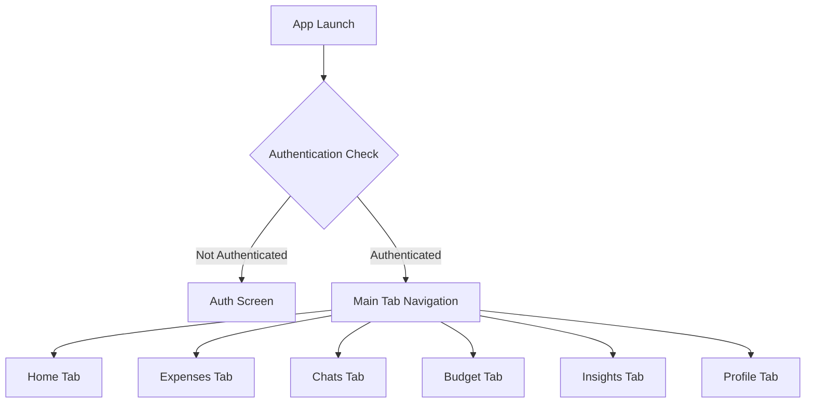
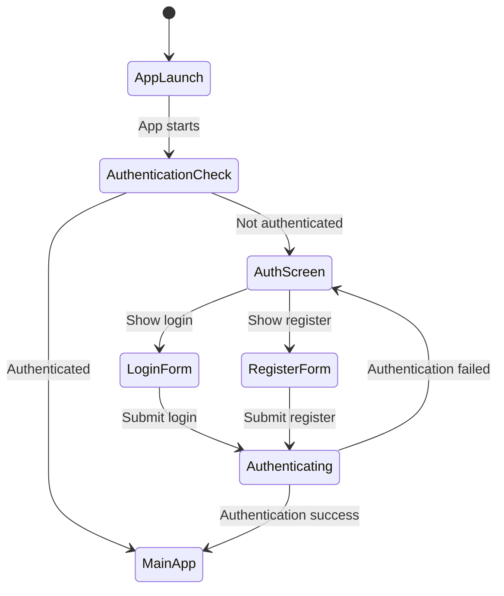
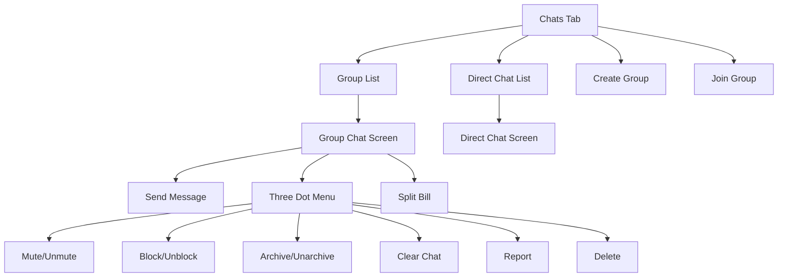
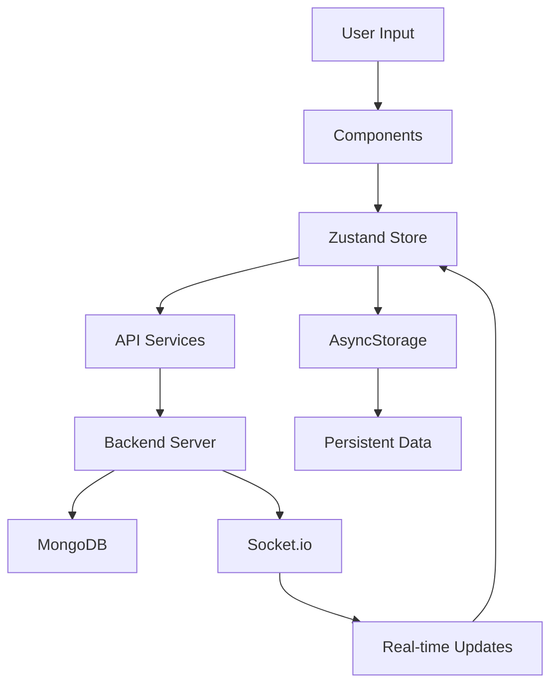

# React Native Chat-Based Finance App

A comprehensive mobile application that combines real-time chat functionality with financial management features, built with React Native, Expo, and Node.js.

## 📋 Table of Contents

- [Features](#features)
- [Architecture Overview](#architecture-overview)
- [App Flow Diagrams](#app-flow-diagrams)
- [Technology Stack](#technology-stack)
- [Project Structure](#project-structure)
- [Setup Instructions](#setup-instructions)
- [API Documentation](#api-documentation)

## ✨ Features

### 💬 Chat Functionality
- **Real-time messaging** with WebSocket support
- **Group chats** for expense sharing
- **Direct messaging** between users
- **Three-dot menu** with comprehensive options:
  - Mute/unmute notifications
  - Block/unblock users
  - Archive/unarchive chats
  - Clear chat history
  - Report users
  - Delete conversations
- **Typing indicators** and read receipts
- **Message reactions** and mentions

### 💰 Finance Management
- **Expense tracking** with categories
- **Split bill functionality** within chats
- **Budget management** with alerts
- **AI-powered insights** and predictions
- **Group expense sharing**
- **Payment tracking** and settlement

### 🔐 Authentication & Security
- **JWT-based authentication**
- **Biometric authentication** support
- **Secure API communication**
- **Data encryption** and validation

### 🎨 User Experience
- **Modern UI** with consistent theming
- **Responsive design** for all screen sizes
- **Offline support** with data synchronization
- **Push notifications** for important updates

## 🏗️ Architecture Overview

The app follows a modern React Native architecture with:

- **Frontend**: React Native + Expo
- **Backend**: Node.js + Express.js
- **Database**: MongoDB
- **Real-time**: Socket.io
- **State Management**: Zustand
- **Navigation**: Expo Router
- **Styling**: StyleSheet with theming

## 📊 App Flow Diagrams

### 1. Main Application Flow



### 2. Authentication State Flow



### 3. Chat Functionality Flow



### 4. Data Flow Architecture



## 🛠️ Technology Stack

### Frontend
- **React Native 0.79.5** - Mobile framework
- **Expo SDK 53** - Development platform
- **TypeScript** - Type safety
- **Expo Router** - Navigation
- **Zustand** - State management
- **Axios** - HTTP client
- **Socket.io-client** - Real-time communication

### Backend
- **Node.js** - Runtime
- **Express.js** - Web framework
- **MongoDB** - Database
- **Socket.io** - Real-time communication
- **JWT** - Authentication
- **Bcrypt** - Password hashing

### Development Tools
- **ESLint** - Code linting
- **Prettier** - Code formatting
- **Expo CLI** - Development server

## 📁 Project Structure

```
react-native-chatbasedfinanceapp/
├── app/                          # Main application code
│   ├── _layout.tsx              # Root layout
│   ├── auth.tsx                 # Authentication screen
│   ├── (tabs)/                  # Tab navigation
│   │   ├── _layout.tsx         # Tab layout
│   │   ├── index.tsx           # Home tab
│   │   ├── expenses.tsx        # Expenses tab
│   │   ├── chats.tsx           # Chats tab
│   │   ├── budget.tsx          # Budget tab
│   │   ├── insights.tsx        # Insights tab
│   │   └── profile.tsx         # Profile tab
│   ├── chat/                    # Chat screens
│   │   └── [userId].tsx        # Direct chat
│   ├── group-chat/              # Group chat screens
│   │   └── [groupId].tsx       # Group chat
│   ├── components/              # Reusable components
│   ├── services/                # API services
│   ├── types/                   # TypeScript types
│   └── utils/                   # Utility functions
├── backend/                     # Backend server
│   ├── server.js               # Main server file
│   ├── models/                 # Database models
│   ├── routes/                 # API routes
│   └── middleware/             # Express middleware
├── assets/                      # Static assets
└── lib/                         # Shared libraries
    ├── store/                  # Zustand stores
    └── services/               # Shared services
```

## 🚀 Setup Instructions

### Prerequisites
- Node.js 18+
- npm or yarn
- MongoDB
- Expo CLI
- Android Studio (for Android development)

### 1. Clone and Install

```bash
git clone <repository-url>
cd react-native-chatbasedfinanceapp

# Install frontend dependencies
npm install

# Install backend dependencies
cd backend
npm install
cd ..
```

### 2. Environment Configuration

Create `.env` file in the root directory:

```env
# OpenAI API Key (optional)
EXPO_PUBLIC_OPENAI_API_KEY=your_openai_api_key_here

# Backend API URL
EXPO_PUBLIC_API_URL=http://10.209.229.172:3001/api

# Frontend URL for CORS
EXPO_PUBLIC_FRONTEND_URL=exp://10.209.229.172:8081
```

Create `.env` file in the `backend` directory:

```env
MONGODB_URI=mongodb://localhost:27017/chatbasedfinance
JWT_SECRET=your_super_secret_jwt_key_here
FRONTEND_URL=exp://10.209.229.172:8081
NODE_ENV=development
PORT=3001
```

### 3. Start MongoDB

```bash
# Make sure MongoDB is running on localhost:27017
mongod
```

### 4. Start Backend Server

```bash
cd backend
npm run dev
```

### 5. Start Frontend App

```bash
# In the main directory
npm run dev
```

### 6. Run on Device/Emulator

- **Android**: Press `a` in the terminal
- **iOS**: Press `i` in the terminal
- **Web**: Press `w` in the terminal

## 📡 API Documentation

### Authentication Endpoints

```javascript
POST /api/auth/register
POST /api/auth/login
POST /api/auth/logout
GET  /api/auth/me
PUT  /api/auth/profile
```

### Expense Endpoints

```javascript
GET  /api/expenses
POST /api/expenses
PUT  /api/expenses/:id
DELETE /api/expenses/:id
GET  /api/expenses/stats
```

### Group Endpoints

```javascript
GET  /api/groups
POST /api/groups
GET  /api/groups/:id
POST /api/groups/:id/members
POST /api/groups/join/:code
POST /api/groups/:id/invite-code
```

### Chat Endpoints

```javascript
GET  /api/chat/:groupId/messages
POST /api/chat/:groupId/messages
PUT  /api/chat/:groupId/messages/read
POST /api/chat/:groupId/messages/:id/reactions
```

### Budget Endpoints

```javascript
GET  /api/budgets
POST /api/budgets
DELETE /api/budgets/:id
GET  /api/budgets/alerts
```

## 🔄 Component Architecture

The app uses a modular component architecture:

- **Pages**: Route-based components
- **Components**: Reusable UI components
- **Services**: API communication layer
- **Store**: Centralized state management
- **Utils**: Helper functions and utilities

## 📱 Key Features Implementation

### Real-time Chat
- WebSocket connection using Socket.io
- Message persistence in MongoDB
- Typing indicators and read receipts
- Group and direct messaging

### Expense Management
- CRUD operations for expenses
- Category-based organization
- Split bill functionality
- Budget tracking with alerts

### AI Integration
- OpenAI API integration
- Spending pattern analysis
- Budget recommendations
- Predictive insights

## 🧪 Testing

```bash
# Run tests
npm test

# Run linting
npm run lint

# Type checking
npx tsc --noEmit
```

## 📦 Build & Deployment

### Development Build
```bash
npm run dev
```

### Production Build
```bash
# Android APK
npx expo run:android --variant release

# iOS
npx expo run:ios --configuration Release
```

### Expo Build
```bash
# Build for app stores
npx expo build:android
npx expo build:ios
```

## 🤝 Contributing

1. Fork the repository
2. Create a feature branch
3. Make your changes
4. Add tests if applicable
5. Submit a pull request

## 📄 License

This project is licensed under the MIT License.

## � Troubleshooting

### Metro Bundler Issues

If you encounter `InternalBytecode.js` errors or Metro cache issues:

```bash
# Option 1: Use the cache clearing script
.\fix-metro-cache.bat

# Option 2: Manual cache clearing
npx expo start --clear

# Option 3: Complete reset
rmdir /s /q node_modules
rmdir /s /q .expo
npm install
npx expo start --clear
```

### Group Settings Update Errors

If group settings updates fail with "Invalid settings data":

1. **Check backend logs** for detailed validation errors
2. **Verify data types** - ensure boolean fields are actually booleans
3. **Check enum values** - currency and splitMethod must be valid options
4. **Restart backend server** if validation logic was updated

### Common Issues

- **"Server error" on split bill creation**: Check backend logs for validation failures
- **Metro bundler hangs**: Clear cache and restart development server
- **Authentication issues**: Verify JWT token and backend connectivity
- **Real-time updates not working**: Check Socket.io connection and server logs

### Development Tips

- Use `console.log` extensively in development to debug API calls
- Check browser Network tab for API request/response details
- Use React Native Debugger for component inspection
- Clear all caches when switching between development environments