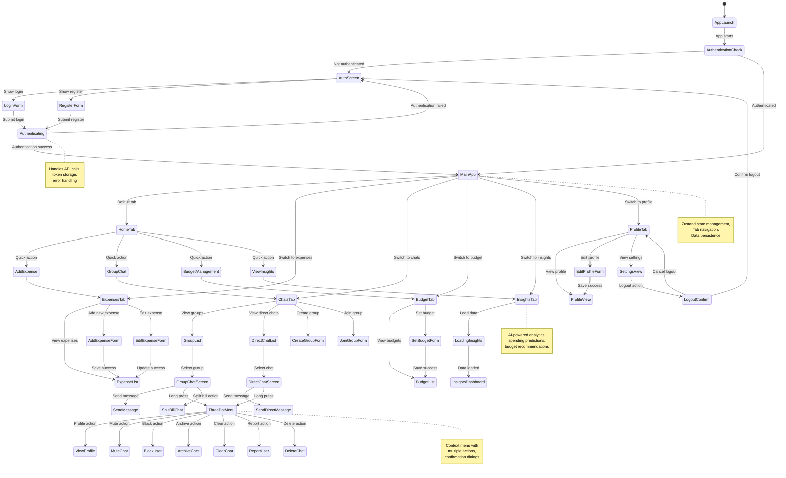

```mermaid
stateDiagram-v2
    [*] --> AppLaunch

    AppLaunch --> AuthenticationCheck: App starts

    AuthenticationCheck --> AuthScreen: Not authenticated
    AuthenticationCheck --> MainApp: Authenticated

    AuthScreen --> LoginForm: Show login
    AuthScreen --> RegisterForm: Show register

    LoginForm --> Authenticating: Submit login
    RegisterForm --> Authenticating: Submit register

    Authenticating --> AuthScreen: Authentication failed
    Authenticating --> MainApp: Authentication success

    MainApp --> HomeTab: Default tab
    MainApp --> ExpensesTab: Switch to expenses
    MainApp --> ChatsTab: Switch to chats
    MainApp --> BudgetTab: Switch to budget
    MainApp --> InsightsTab: Switch to insights
    MainApp --> ProfileTab: Switch to profile

    HomeTab --> AddExpense: Quick action
    HomeTab --> GroupChat: Quick action
    HomeTab --> BudgetManagement: Quick action
    HomeTab --> ViewInsights: Quick action

    AddExpense --> ExpensesTab
    GroupChat --> ChatsTab
    BudgetManagement --> BudgetTab
    ViewInsights --> InsightsTab

    ExpensesTab --> ExpenseList: View expenses
    ExpensesTab --> AddExpenseForm: Add new expense
    ExpensesTab --> EditExpenseForm: Edit expense

    AddExpenseForm --> ExpenseList: Save success
    EditExpenseForm --> ExpenseList: Update success

    ChatsTab --> GroupList: View groups
    ChatsTab --> DirectChatList: View direct chats
    ChatsTab --> CreateGroupForm: Create group
    ChatsTab --> JoinGroupForm: Join group

    GroupList --> GroupChatScreen: Select group
    DirectChatList --> DirectChatScreen: Select chat

    GroupChatScreen --> SendMessage: Send message
    GroupChatScreen --> ThreeDotMenu: Long press
    GroupChatScreen --> SplitBillChat: Split bill action

    DirectChatScreen --> SendDirectMessage: Send message
    DirectChatScreen --> ThreeDotMenu: Long press

    ThreeDotMenu --> ViewProfile: Profile action
    ThreeDotMenu --> MuteChat: Mute action
    ThreeDotMenu --> BlockUser: Block action
    ThreeDotMenu --> ArchiveChat: Archive action
    ThreeDotMenu --> ClearChat: Clear action
    ThreeDotMenu --> ReportUser: Report action
    ThreeDotMenu --> DeleteChat: Delete action

    BudgetTab --> BudgetList: View budgets
    BudgetTab --> SetBudgetForm: Set budget

    SetBudgetForm --> BudgetList: Save success

    InsightsTab --> LoadingInsights: Load data
    LoadingInsights --> InsightsDashboard: Data loaded

    ProfileTab --> ProfileView: View profile
    ProfileTab --> EditProfileForm: Edit profile
    ProfileTab --> SettingsView: View settings

    EditProfileForm --> ProfileView: Save success

    SettingsView --> LogoutConfirm: Logout action

    LogoutConfirm --> AuthScreen: Confirm logout
    LogoutConfirm --> ProfileTab: Cancel logout

    note right of Authenticating
        Handles API calls,
        token storage,
        error handling
    end note

    note right of MainApp
        Zustand state management,
        Tab navigation,
        Data persistence
    end note

    note right of ThreeDotMenu
        Context menu with
        multiple actions,
        confirmation dialogs
    end note

    note right of InsightsTab
        AI-powered analytics,
        spending predictions,
        budget recommendations
    end note
```